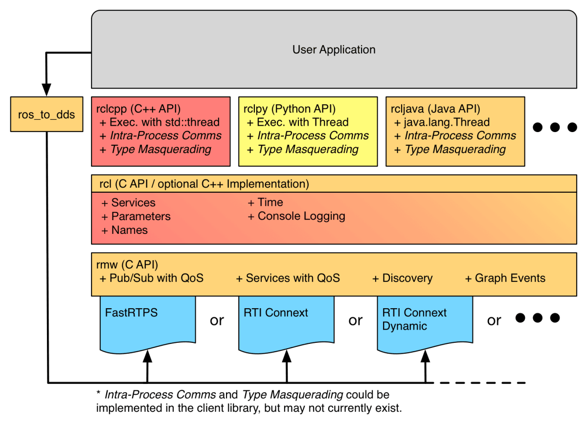

# メインループのないノード
hello.cppから処理の内容を確認していきます。

## 初期化と終了処理
hello.cppのmain関数では最初と最後は初期化と終了処理になっています。  
rclcppは、初期化の`init()`と終了の`shutdown()`が必要なライブラリです。


図からわかるようにROS2には各言語で異なるライブラリを持っており、C++では`rclcpp`を、pythonでは`rclpy`を使うことになります。

## 出力処理
直接的に出力処理を行っているのは次の行です。
```cpp
auto node = rclcpp::Node::make_shared("hello");
RCLCPP_INFO(node->get_logger(), "Hello, ROS2 world!");
```

始めに`make_shared()`でノードを作成してnode変数に代入しています。  
ここで、node変数は具体的な型を指定せず、autoを使って型推論させています。  
ROSではノード協調によってアプリケーションを作るため、このように最初にノードを作成することになります。  
そして、`RCLCPP_INFO`を使って標準出力を行っています。  
このコードでは、実行後`shutdown()`を実行するため、標準出力を行うとプログラミングが終了しますが、実際のアプリケーションではループで繰り返し処理を行うことが多いため、以降ではメインループを記述します。


# メインループのあるノード
hello.cppをメインループを追加して、何度もhello world を標準出力するように変更します。  
hello_loop.cppを `/workspaces/study-ros/src/my_first_package/src` のフォルダに作成してみます。

## プログラミングの準備
```cpp
# include "rclcpp/rclcpp.hpp"

int main(int argc, char** argv){
    rclcpp::init(argc, argv);

    auto node = rclcpp::Node::make_shared("hello_loop");
    RCLCPP_INFO(node->get_logger(), "Hello, Before loop ROS2 world!");

    rclcpp::WallRate loop(1);
    while (rclcpp::ok())
    {
        RCLCPP_INFO(node->get_logger(), "Hello, ROS2 world!");
        loop.sleep();
    }
    
    rclcpp::shutdown();
    return 0;
}
```

主な変更点は下の部分の追加です。  
実際にはこの`loop.sleep()`の部分にセンサ値を取得するなどの処理を入れることになります。
```diff
+ rclcpp::WallRate loop(1);
+ while (rclcpp::ok())
+ {
+     RCLCPP_INFO(node->get_logger(), "Hello, ROS2 world!");
+     loop.sleep();
+ }
```

whileの条件である`rclcpp::ok()`は、終了シグナル`Ctrl+C`を受け取っていなければ`true`を返すため、`Ctrl+C`を押すまでずっと処理が継続します。  
`loop.sleep()`では`loop`の宣言時に与えた引数だけsleepするので、今回の例では1secごとに終了判定してようになっています。


### CMakeListsの準備
CMakeLists.txtも変更してhello_loopを追加してpackageに追加します。
CMakeLists.txtは次のようにしてみました。

```CMake
cmake_minimum_required(VERSION 3.5)
project(my_first_package)

# Default to C99
if(NOT CMAKE_C_STANDARD)
  set(CMAKE_C_STANDARD 99)
endif()

# Default to C++14
if(NOT CMAKE_CXX_STANDARD)
  set(CMAKE_CXX_STANDARD 14)
endif()

if(CMAKE_COMPILER_IS_GNUCXX OR CMAKE_CXX_COMPILER_ID MATCHES "Clang")
  add_compile_options(-Wall -Wextra -Wpedantic)
endif()

# find dependencies
find_package(ament_cmake REQUIRED)
# uncomment the following section in order to fill in
# further dependencies manually.
# find_package(<dependency> REQUIRED)
find_package(rclcpp REQUIRED)

add_executable(hello src/hello.cpp)
ament_target_dependencies(hello rclcpp)
install(TARGETS hello DESTINATION lib/${PROJECT_NAME})

add_executable(hello_loop src/hello_loop.cpp)
ament_target_dependencies(hello_loop rclcpp)
install(TARGETS hello_loop DESTINATION lib/${PROJECT_NAME})

if(BUILD_TESTING)
  find_package(ament_lint_auto REQUIRED)
  # the following line skips the linter which checks for copyrights
  # uncomment the line when a copyright and license is not present in all source files
  #set(ament_cmake_copyright_FOUND TRUE)
  # the following line skips cpplint (only works in a git repo)
  # uncomment the line when this package is not in a git repo
  #set(ament_cmake_cpplint_FOUND TRUE)
  ament_lint_auto_find_test_dependencies()
endif()

ament_package()
```

追加したのは以下の部分です。
```diff
+ add_executable(hello_loop src/hello_loop.cpp)
+ ament_target_dependencies(hello_loop rclcpp)
+ install(TARGETS hello_loop DESTINATION lib/${PROJECT_NAME})
```

## 動作確認
`/workspaces/study-ros/src`のディレクトリでcolcon buildします。  
エラーが出なければ、ターミナルを二つ準備して、コマンドを順番に実行することでノードの確認をしてみましょう。
```bash
ros2 run my_first_package hello_loop
```
> 出力例
> 以下のようにして出力されていきます。
> ```
> [INFO] [1718959141.850875000] [hello]: Hello, Before loop ROS2 world!
> [INFO] [1718959141.850961100] [hello]: Hello, ROS2 world!
> [INFO] [1718959142.851099100] [hello]: Hello, ROS2 world!
> [INFO] [1718959143.851124300] [hello]: Hello, ROS2 world!
> [INFO] [1718959144.851161300] [hello]: Hello, ROS2 world!
> ```

実行が続いている状態で、別のターミナルで以下のコマンドを実行すると、ノードが存在することを確認できます。
```bash
ros2 node list
```

> 出力例
> ```
> /hello_loop
> ```


より詳しい情報は次のコマンドで確認することができます。
```bash
ros2 node info /hello_loop
```
> 出力例
> ```
> /hello_loop
>   Subscribers:
>     /parameter_events: rcl_interfaces/msg/ParameterEvent
>   Publishers:
>     /parameter_events: rcl_interfaces/msg/ParameterEvent
>     /rosout: rcl_interfaces/msg/Log
>   Service Servers:
>     /hello_loop/describe_parameters: rcl_interfaces/srv/DescribeParameters
>     /hello_loop/get_parameter_types: rcl_interfaces/srv/GetParameterTypes
>     /hello_loop/get_parameters: rcl_interfaces/srv/GetParameters
>     /hello_loop/list_parameters: rcl_interfaces/srv/ListParameters
>     /hello_loop/set_parameters: rcl_interfaces/srv/SetParameters
>     /hello_loop/set_parameters_atomically: rcl_interfaces/srv/SetParametersAtomically
>   Service Clients:
> 
>   Action Servers:
> 
>   Action Clients:
> ```

以上のようにして、ループ処理を持つノードの立ち上げと確認をすることができます。