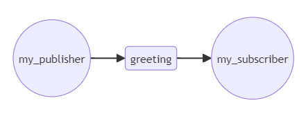

# パブリッシャーとサブスクライバー
ここでは、パブリッシャーとサブスクライバーを作ってみます。  
- メッセージの送り手：パブリッシャー
- メッセージの受け手：サブスクライバー

`my_publisher`というノードと`my_subscriber`というノードを作り、`greeting`トピックを介して、メッセージを送るというプログラムを作ってみましょう。


# パブリッシャー
`/workspaces/study-ros/src/my_first_package/src`の中に`my_publisher.cpp`を作っていきましょう。  
以下のように書いてみました。
```cpp
#include "rclcpp/rclcpp.hpp"
#include "std_msgs/msg/string.hpp"

int main(int argc, char **argv)
{
  rclcpp::init(argc, argv);
  auto node = rclcpp::Node::make_shared("my_publisher");
  auto publisher = node->create_publisher<std_msgs::msg::String>("greeting", 1);

  rclcpp::WallRate loop(1);
  int count = 0;
  while (rclcpp::ok()) {
    auto msg = std_msgs::msg::String();
    msg.data = "Hello, world " + std::to_string(count++);
    publisher->publish(msg);
    loop.sleep();
  }

  rclcpp::shutdown();
  return 0;
}
```

## パブリッシュの中身
プログラムの中身について見ていきましょう。  
まず`init()` で`rclcpp`ライブラリを初期化します。  
次に`make_shared()`でノードを作ります。`make_shared()`の引数の文字列がノード名です。  
`createe_publisher()`でノードからパブリッシュできるようにします。  
第一引数がトピック名で、第二引数の数値はQoS(→The Quality of Service settings for the publisher)です。  
QoSは数値を大きくするとパブリッシュの品質が上がるような説明になっています。(詳しくは不明)  
メインループ内で`count`をインクリメントしながら`publist()`していくようになっています。

# サブスクライバー
パブリッシャーと同様にしてサブスクライバーを作ってみます。  
`/workspaces/study-ros/src/my_first_package/src`に`my_subscriber.cpp`を作成し、次のプログラムを書いてみます。
```cpp
#include "rclcpp/rclcpp.hpp"
#include "std_msgs/msg/string.hpp"

rclcpp::Node::SharedPtr g_node = nullptr;

void callback(const std_msgs::msg::String::SharedPtr msg)
{
  RCLCPP_INFO(g_node->get_logger(), "%s", msg->data.c_str());
}

int main(int argc, char **argv)
{
  rclcpp::init(argc, argv);
  g_node = rclcpp::Node::make_shared("my_subscriber");
  auto subscriber = g_node->create_subscription<std_msgs::msg::String>("greeting", 1, callback);

  rclcpp::spin(g_node);

  g_node = nullptr;
  rclcpp::shutdown();
  return 0;
}
````

サブスクライバーにはパブリッシャーと違って、グローバル変数とコールバック関数があります。  
それぞれについて詳しく見ていきましょう。

## サブスクライブ側の初期化
`init()`の初期化と`make_shared()`によるノード作成はパブリッシャーと同じです。  
`create_subscription()`でサブスクライブできるようにします。  
ここで、第一引数と第二引数はパブリッシャーと同じですが、第三引数にコールバック関数を指定します。  
コールバック関数はメッセージをサブスクライブしたタイミングで呼び出されます。
サブスクライブの準備ができたら`spin()`でコールバックを待機します。

## コールバック関数
コールバック関数は引数にメッセージを受け取って呼び出されます。  
コールバック関数では、メッセージのデータ部分を文字列に変換して`RCLCPP_INFO()`で標準出力します。  
コールバック関数とメイン関数でノードにアクセスしたかったのでグローバル変数`g_node`を宣言していますが、これはあまり良いやり方ではありません。これは後の会で改善します。


# 動作確認
ビルド設定ファイル`CMakeLists.txt`を編集し、ビルドしてノードの動作確認を行います。  
ビルドの設定ができると`/workspaces/study-ros/src`のディレクトリで`colcon build`を実行します。
ビルドに成功したら2つのターミナルを開いてそれぞれ実行します。

```bash
ros2 run my_first_package my_subscriber
```

```bash
ros2 run my_first_package my_publisher
```

> サブスクライバーではパブリッシャーが送ったメッセージを標準出力します。
> ```
> [INFO] [1718973565.485968100] [my_subscriber]: Hello, world 0
> [INFO] [1718973566.486004500] [my_subscriber]: Hello, world 1
> [INFO] [1718973567.486726300] [my_subscriber]: Hello, world 2
> [INFO] [1718973568.486199200] [my_subscriber]: Hello, world 3
> ...
> ```

# さいごに
サブスクライブのコールバック関数がどれだけの周期で呼び出されいるのかきになりました。  
おそらくパブリッシャーよりも十分に早い周期で呼び出されていて動作に影響はない、みたいな話かと推察しましたが、、、  
実際にはサブスクライブ側でも処理をすることになるので、パブリッシュしたタイミングで`spin()`されていなかった場合にはどうなるのかなど気になる点は多数ありますね。  
とりあえず進めていって様子を見ていきましょう。