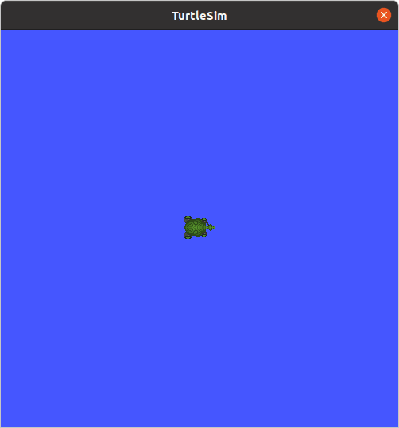
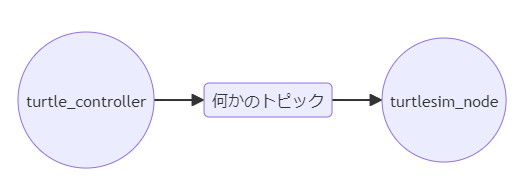
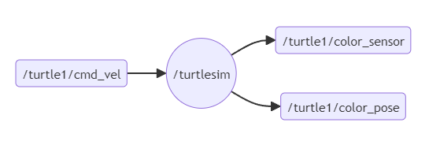
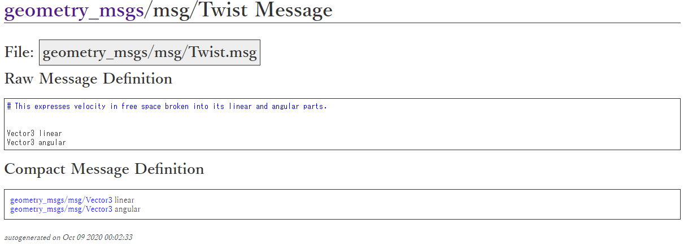
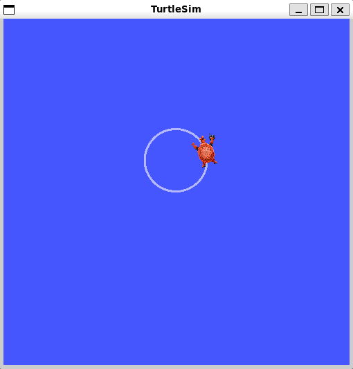

# はじめに
ROS2でプログラミングで亀を制御するノードを作ってみます。  
ROS2の初心者向けデモパッケージとして`turtlsim`があります。  
`turtlesim`は`ros-foxy-desktop`インストール時に自動でインストールされているはずはので以下のコマンドで実行できるはずです。  
```bash
ros2 run turtlesim turtlesim_node
```
実行すると以下のようなwindowが立ち上がります。  
ここで、wslなどではxserverなどGUI表示をするための設定ができていない場合は表示されないので、設定できていない場合はwindowsにVcXsrvを[install](https://sourceforge.net/projects/vcxsrv/)し、ubunut, docker containerに`x11-apps`などをinstallして設定してください。  


以下の図のようにturtlesimの亀をコントロールするアプリケーションを作成します。  


`turtle_controller`ノードからトピックを介して`turtlesim_node`へメッセージを送り、そのメッセージによって亀が動くというプログラミングになります。

# ノードとトピックを調べる
`turtlesim`を実行している状態で以下のコマンドを実行することで確認します。
```bash
ros2 node list
```
> ノードはturtlesimがあることが確認できます。
> ```
> /turtlesim
> ```

```bash
ros2 topic list
```
> トピックがたくさんあることが確認できます。
> `parameter_events`と`rosout`はなにも実行してなくてもあるトピックです。
> そのためここでは`turtle1`関係のトピックが増えていることになります。
> ```
> /parameter_events
> /rosout
> /turtle1/cmd_vel
> /turtle1/color_sensor
> /turtle1/pose
> ```

より詳しくノードを調べてみるために次のコマンドを実行します。
```bash
ros2 node info /turtlesim
```
> 以下のように表示されました。
> `/turtle1/cmd_vel`をサブスクライブしていて、`/turtle1/color_sensor`や`/turtle1/pose`をパブリッシュしていることがわかりました。
> ```
> /turtlesim
>   Subscribers:
>     /parameter_events: rcl_interfaces/msg/ParameterEvent
>     /turtle1/cmd_vel: geometry_msgs/msg/Twist
>   Publishers:
>     /parameter_events: rcl_interfaces/msg/ParameterEvent
>     /rosout: rcl_interfaces/msg/Log
>     /turtle1/color_sensor: turtlesim/msg/Color
>     /turtle1/pose: turtlesim/msg/Pose
>   Service Servers:
>     /clear: std_srvs/srv/Empty
>     /kill: turtlesim/srv/Kill
>     /reset: std_srvs/srv/Empty
>     /spawn: turtlesim/srv/Spawn
>     /turtle1/set_pen: turtlesim/srv/SetPen
>     /turtle1/teleport_absolute: turtlesim/srv/TeleportAbsolute
>     /turtle1/teleport_relative: turtlesim/srv/TeleportRelative
>     /turtlesim/describe_parameters: rcl_interfaces/srv/DescribeParameters
>     /turtlesim/get_parameter_types: rcl_interfaces/srv/GetParameterTypes
>     /turtlesim/get_parameters: rcl_interfaces/srv/GetParameters
>     /turtlesim/list_parameters: rcl_interfaces/srv/ListParameters
>     /turtlesim/set_parameters: rcl_interfaces/srv/SetParameters
>     /turtlesim/set_parameters_atomically: rcl_interfaces/srv/SetParametersAtomically
>   Service Clients:
> 
>   Action Servers:
>     /turtle1/rotate_absolute: turtlesim/action/RotateAbsolute
>   Action Clients:
> ```
/turtlesimのノードを図示すると次のようになっていることがわかりました。

それでは、`turtle1/cmd_vel`のトピックを詳しくみてみましょう。
```bash
ros2 topic info /turtle1/cmd_vel
```

> 次のように表示されました。`geometry_msgs/msg/Twist`という型のメッセージを扱っていることがわかりました。  
> そのため、`/turtle1/cmd_vel`にこの型のメッセージをパブリッシュすれば`turtlesim`が受け取ってくれるようです。
> ```
> Type: geometry_msgs/msg/Twist
> Publisher count: 0
> Subscription count: 1
> ```


# ノードの作成
これまでと同様に`/workspaces/study-ros/src/my_first_package/src`にソースファイルを作成し、ビルド設定ファイルを編集していきます。

## ソースファイル
`my_turtle_controller.cpp`という名前で次のようなプログラムを書いてみました。
```cpp
#include "rclcpp/rclcpp.hpp"
#include "geometry_msgs/msg/twist.hpp"

int main(int argc, char **argv)
{
  rclcpp::init(argc, argv);
  auto node = rclcpp::Node::make_shared("turtle_controller");
  auto publisher = node->create_publisher<geometry_msgs::msg::Twist>("/turtle1/cmd_vel", 1);

  rclcpp::WallRate loop(1);
  while (rclcpp::ok()) {
    auto msg = geometry_msgs::msg::Twist();
    msg.linear.x = 1.0;
    msg.angular.z = 1.0;
    publisher->publish(msg);
    loop.sleep();
  }

  rclcpp::shutdown();
  return 0;
}
```
構成は前回の`my_publisher`にかなり似ています。
異なるとはノード名、トピック名、メッセージの型、メッセージの作り方ぐらいです。
`geometry_msg`については[ドキュメント](https://docs.ros.org/en/api/)の該当部分を探せば仕様がわかるようになっているようですが、ドキュメントが実質ドキュメントではないレベルにわかりにくいですね…  
今回使用しているものについては[こちら](https://docs.ros2.org/foxy/api/geometry_msgs/msg/Twist.html)にあり、以下のような内容になっています。  
  
記事には、Twist型には、linearにXYZの並進速度、angularにはXYZ周りの回転速度が入っていると書いてあります。  
実際にはドキュメントからわかるのは3次元ベクトルというところまでのように見えるので、このあたりは使用例などから推察するなどが必要になりそうです。(実際自分で作る分にはコードがあるので問題ないと思います。)  
今回はlinear.xでx方向への移動と、angular.zでz方向の回転方向を設定しています。(それぞれの値は亀視点の方向？なのかとなりました。)  

## ビルド設定ファイル
メッセージ型を使えるようにする行と、実行ファイルをビルドする行を追加します。
```diff
+ find_package(geometry_msgs REQUIRED)
+ add_executable(my_turtle_controller src/my_turtle_controller.cpp)
+ ament_target_dependencies(my_turtle_controller rclcpp geometry_msgs)
+ install(TARGETS my_turtle_controller DESTINATION lib/${PROJECT_NAME})
```

# 動作確認
`/workspaces/study-ros/src/my_first_package/src`のディレクトリでcolcon buildを実行して動作確認します。
```bash
ros2 run my_first_package my_turtle_controller
```
> 亀がぐるぐる円を描くように動いてくれました。  
> 

# おわりに
以上のようにして、ノード間のpub/subでturtlesimの亀を動かすことができました。