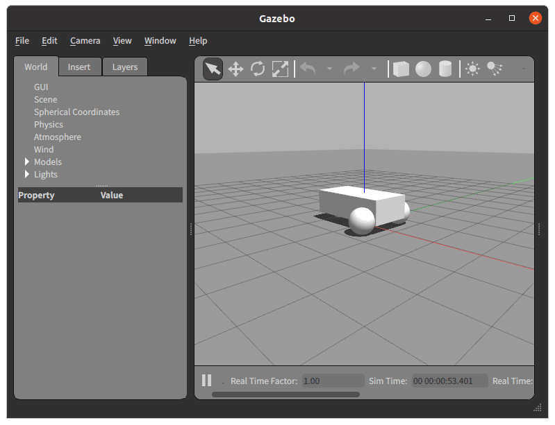

# はじめに
今回はシミュレーションでロボットを動かしてみましょう。

# Gazebo
[Gazebo](https://gazebosim.org/home)というシミュレータを使えば、ロボットを動かすことができます。
次のコマンドを実行して、Gazeboが立ち上がることを確認しましょう。
```bash
gazebo /opt/ros/foxy/share/gazebo_plugins/worlds/gazebo_ros_diff_drive_demo.world
```
起動できたら次のwindowが立ち上がります。

さらに別のターミナルで次のコマンドを実行するとロボットが動きます。
```bash
ros2 topic pub /demo/cmd_demo geometry_msgs/Twist '{linear: {x: 1.0}}' -1
```

# TurtleBot3
Gazeboの動作角煮で見たロボットは直方体と球で構成されていました。  
ROS学習用ロボットキットのTurtleBot3というロボットでシミュレーションすることができます。  
なおTurtleBot 3は「Burger」と「Waffle Pi」があり、ここで使うのは`TurtleBot 3 Burger`です。  

## 準備
`/workspaces/study-ros/src`で次のコマンドを実行して、シミュレータを動かすためのレポジトリをcloneします。
```bash
git clone -b foxy-devel https://github.com/ROBOTIS-GIT/turtlebot3_simulations.git
```
次にビルドします。
```bash
colcon build --symlink-install
```

## シミュレータの実行
```bash
export TURTLEBOT3_MODEL=burger
ros2 launch turtlebot3_gazebo turtlebot3_world.launch.py
```
次のようなwindowが立ち上がります。  


さらに次のコマンドを実行するとキーボードで操作することができます。
```bash
ros2 run turtlebot3_teleop teleop_keyboard
```

# おわりに
Gazeboを使うことでロボットのシミュレーションを行うことができました。